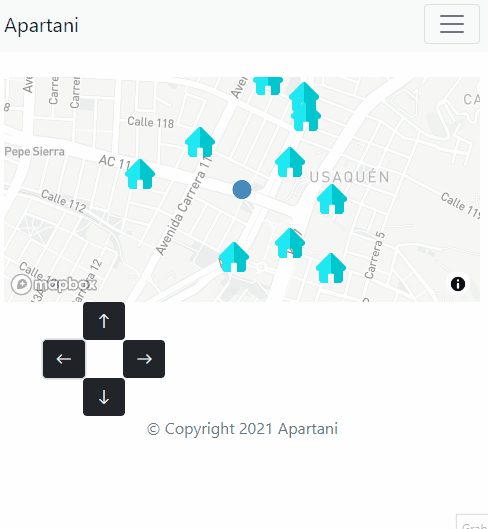

# Apartani realtime search

Real time house search using Socket.io, Flask and Redis JSON database

## Steps to run 


### 1. Install and run Redis JSON
```
docker run -p 6379:6379 --name redis-redisjson redislabs/rejson:latest
```

### 2. Clone this repository
```
git clone https://github.com/redis-developer/apartani-realtime-search.git
```

```
cd apartani-realtime-search
```

### 3. Create virutalenv

```
virtualenv venv
```

### 4. Activate the enviroment
```
#Linux
source venv/bin/activate

#Windows
source venv/Scripts/activate
```
### 5. Install requirements
```
pip install -r requirements.txt
```
### 6. Install the required modules

```
pip install flask
pip install rejson
```

### 7. Run the app

```
python app.py
```

### 8. View the app

```
localhost:5000
```
_the web app was designed for mobile view_



[Demo video of my app](https://www.youtube.com/watch?v=5GfeurLWDrU)

Icons made by [Freepik](https://www.freepik.com) from [Flaticon](https://www.flaticon.com/)

